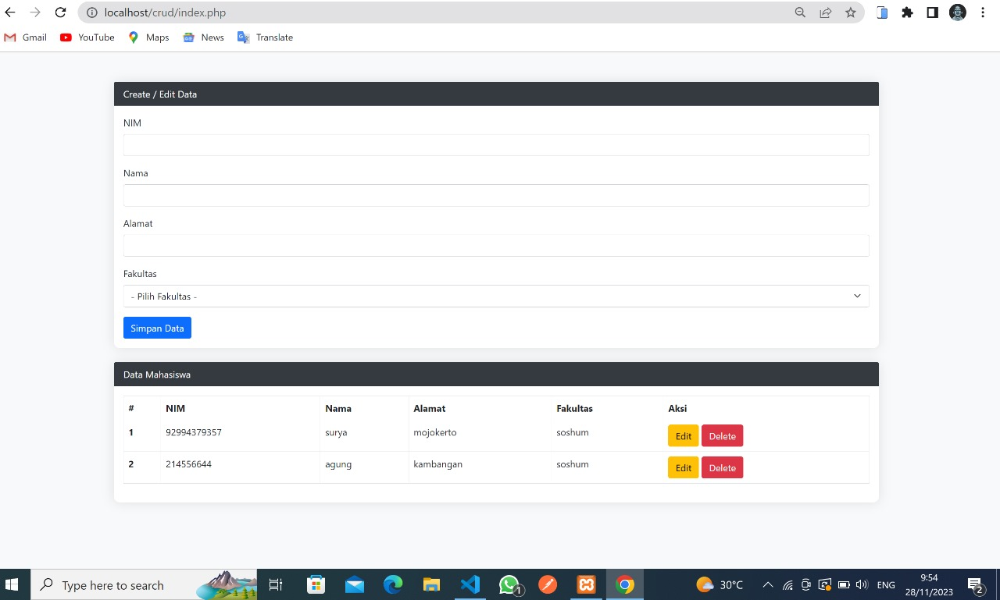

## Sistem Informasi Data Mahasiswa

### Deskripsi Proyek
Proyek ini merupakan implementasi dasar CRUD (Create, Read, Update, Delete) untuk data mahasiswa menggunakan PHP dan MySQL. Aplikasi ini memungkinkan pengguna untuk menambahkan, mengedit, dan menghapus data mahasiswa melalui antarmuka web.

### Persyaratan Sistem
1. **Web Server:**
   - Pastikan Anda memiliki server web (misalnya Apache) dan PHP yang sudah terinstal di lingkungan pengembangan Anda.

2. **Database:**
   - Pastikan Anda memiliki server database MySQL.
   - Buat database baru dengan nama "akademik".
   - Sesuaikan parameter koneksi database (host, user, password) pada file `index.php` sesuai dengan konfigurasi MySQL Anda.

3. **Bootstrap:**
   - Proyek ini menggunakan Bootstrap versi 5 untuk tata letak dan gaya. Link CDN Bootstrap sudah disertakan di bagian head file `index.php`.

### Cara Menggunakan
1. **Clone Repository:**
   ```bash
   git clone https://github.com/Azmiriyadin/webcrud.git
   ```

2. **Konfigurasi Database:**
   - Buka file `index.php`.
   - Sesuaikan parameter koneksi database pada bagian awal file dengan informasi database Anda.

3. **Jalankan Aplikasi:**
   - Buka proyek di browser dengan mengakses `http://localhost/crud`.

4. **Operasi CRUD:**
   - Tambahkan data baru: Isi formulir pada bagian "Create / Edit Data" dan klik tombol "Simpan Data".
   - Edit data: Klik tombol "Edit" pada baris data yang ingin diubah, lalu lakukan perubahan dan simpan.
   - Hapus data: Klik tombol "Delete" pada baris data yang ingin dihapus, konfirmasi penghapusan.

### Struktur Proyek
- `index.php`: File utama dengan logika PHP, formulir HTML, dan tampilan data.
- `README.md`: Dokumentasi proyek.

### Penting
- Pastikan untuk memasukkan semua informasi yang diperlukan pada formulir untuk operasi tambah dan ubah data.
- Hati-hati dengan pengaturan hak akses database dan pastikan untuk mengamankan input pengguna.

### Kontribusi
Jika Anda ingin berkontribusi pada proyek ini, silakan fork repository ini dan buat pull request dengan perubahan Anda.

### Lisensi
Proyek ini dilisensikan di bawah [lisensi MIT](LICENSE).

### Kontak
Jika Anda memiliki pertanyaan atau masukan, silakan hubungi [Azmi Riyadin] di [mzamzamiriyadin@gmail.com].

Terima kasih telah menggunakan aplikasi ini! 🚀


